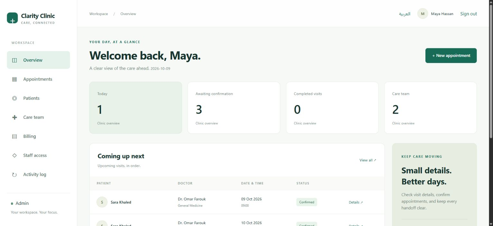
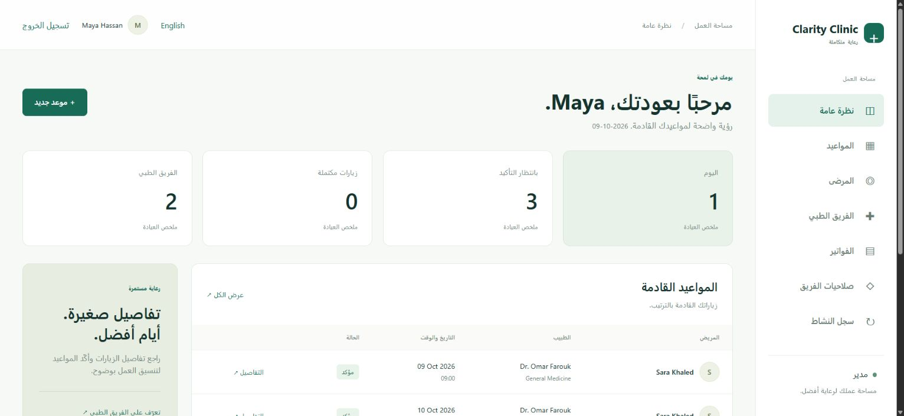

# Clarity Clinic
### A calmer workspace for everyday care.

A bilingual general-clinic application built with Laravel 12, PHP, Blade and a lightweight responsive interface. Arabic includes RTL navigation and forms. English and Arabic can be switched without leaving the current page.

This release replaces the original separate dashboards with a shared workspace governed by role and record ownership. It is ready for **staging evaluation**. A real launch still requires hosting, SMTP, operational policies and the checks in [Deployment](docs/DEPLOYMENT.md).

## Workspace preview

Screenshots use fictional local demo data.





## What works

- Patient registration, verified-email access, password reset and account settings.
- Administrator, doctor, receptionist and patient roles.
- Appointment availability based on each doctor's working days, hours and visit length.
- Booking, confirmation, completion, cancellation and staff rescheduling.
- Database-enforced slot uniqueness plus transactional locks and duration-overlap checks.
- Patient contact directory and staff-created patient accounts.
- Doctor fees and schedules; existing invoices preserve their original fee.
- Encrypted clinical notes restricted to the assigned clinician and administrators.
- One invoice per appointment; payment recording, duplicate-payment protection and printable invoices.
- Staff access management and an audit history without medical text.
- Responsive desktop/mobile layouts, validation, empty states, search and pagination.

## Run locally

Requirements: PHP 8.2+, Composer 2, Node 22, PDO SQLite (or MySQL).

```sh
composer install
npm ci
cp .env.example .env
php artisan key:generate
# Create an empty database/database.sqlite file if needed.
php artisan migrate
npm run build
php artisan clinic:admin you@example.com --name="Your Name"
php artisan serve
```

On Windows, use `Copy-Item .env.example .env` instead of `cp`, and `New-Item database/database.sqlite -ItemType File` to create the database.

### Isolated demo

Only on an **empty local database**:

```sh
php artisan db:seed --class=DemoSeeder
```

Local demo accounts: `admin@clinic.example`, `doctor@clinic.example`, `receptionist@clinic.example`, `patient@clinic.example`. Password: `LocalPreview2026!`.

These are fictional development accounts, blocked from seeding in production. Never use them on a public deployment. No accounts are created by normal migrations or the default seeder.

## Checks

```sh
php artisan test
vendor/bin/pint --test
npm run build
composer audit
npm audit
php artisan view:cache
php artisan route:cache
```

GitHub Actions runs tests on PHP 8.2/8.3 and SQLite/MySQL 8. Booking tests cover role bypass attempts, duplicate reservations, cancellation, rescheduling, changing slot durations, invoice ownership, repeated payments and encrypted note access.

## Project structure

- `app/Services/BookingService.php`: availability, reservation transactions and state transitions.
- `app/Http/Controllers/ClinicController.php`: clinic workflows and server-side authorization.
- `app/Http/Middleware`: role enforcement, language context and response headers.
- `resources/views/clinic`: application views and reusable partials.
- `resources/css/app.css`: responsive design, RTL and print styling.
- `lang/ar.json`, `lang/ar`: Arabic interface, validation and authentication messages.
- `tests/Feature/ClinicOperationsTest.php`: business-flow and access-control tests.

## Before launch

Read [Deployment & operations](docs/DEPLOYMENT.md) and [Security](SECURITY.md). Run `php artisan clinic:preflight` on staging/production. Do not use real patient data until the clinic operator has approved access, privacy/retention procedures, backups and recovery.

Payment recording does not process online payments. SMS, automated visit reminders, insurance, labs, uploads and refund workflows are outside this release.

## Project history

Developed from the collaborative [clinic_system project](https://github.com/ABDELRAHMAN-MAHM0UD/clinic_system). The existing repository history and contributor attribution are retained.
